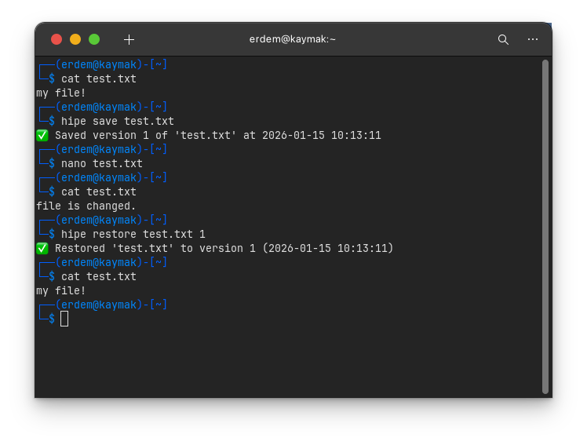

# HIPE: File Versioning CLI

HIPE is a Linux terminal tool that tracks changes in your files directly from your terminal. Save versions, compare, and restore with ease – all without leaving the CLI. Quick, minimal, and practical.

---

## Features ✨

- 💾 Save snapshots of your files with a single command
- 📜 View version history of any tracked file
- 🔄 Restore files to any previous version
- 🆚 Compare changes between versions with a diff
- 🚀 Simple installation with install.sh
- 📌 Version info with --version
- 🎨 Clean, emoji-enhanced terminal output

---

## Installation 

```bash
git clone https://github.com/YusufEremK/hipe.git
cd hipe
chmod +x install.sh
./install.sh
```

### Requirements
- Python 3 or higher
- `pip` (Python package manager)

---

## Uninstallation

```bash
./install.sh -u
```

---

## Usage

### Save a file version
```bash
hipe save file.txt
```

### View version history
```bash
hipe history file.txt
```

### Restore a previous version
```bash
hipe restore file.txt 3
```

### Show version
```bash
hipe --version
```

### Compare two versions
```bash
hipe diff file.txt 2 5
```

---

## Example Usage


## Example Output

```bash
$ hipe history file.txt
Version 1 - 2026-01-15 10:12
Version 2 - 2026-01-15 12:45
Version 3 - 2026-01-15 14:30
```

## How It Works

HIPE saves snapshots of your files in a local ```.hipe_versions``` directory. Each save is timestamped, allowing you to track changes, restore previous versions, and compare differences using built-in diff commands. Everything is local, fast, and requires no external services.

---

## License

MIT License - see LICENSE file for details

---


